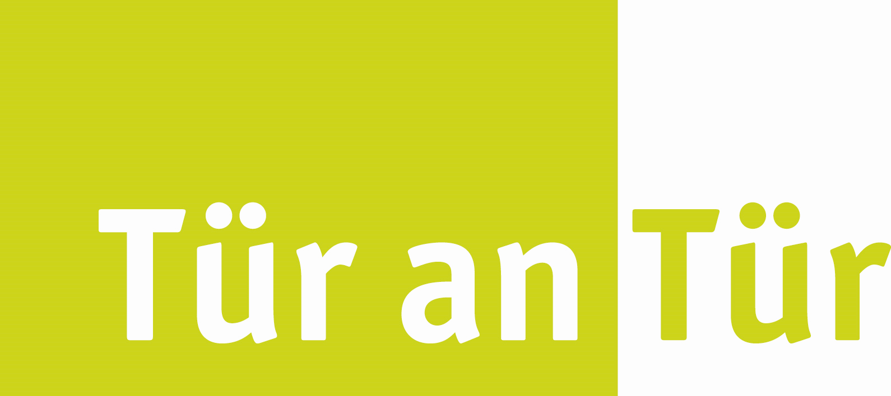
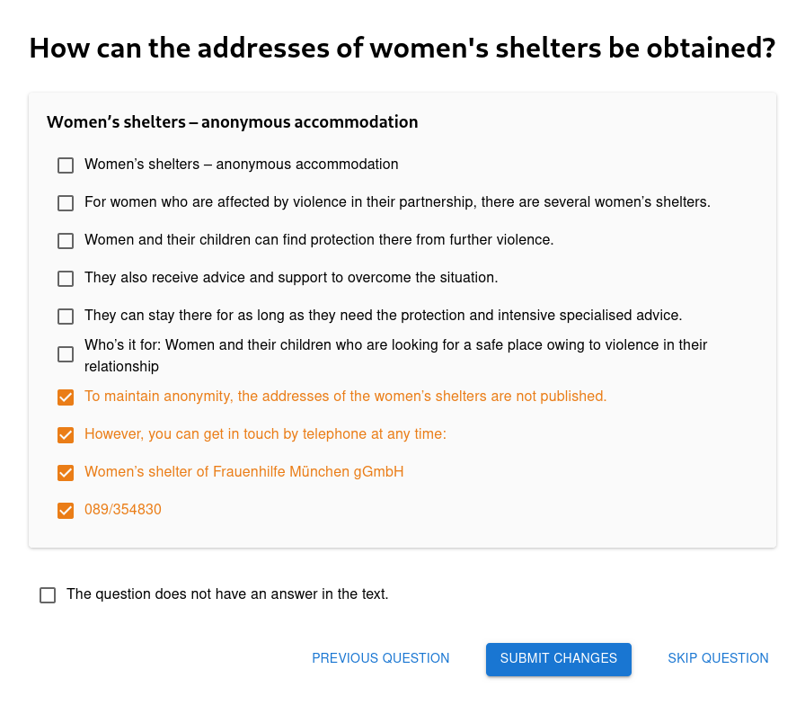
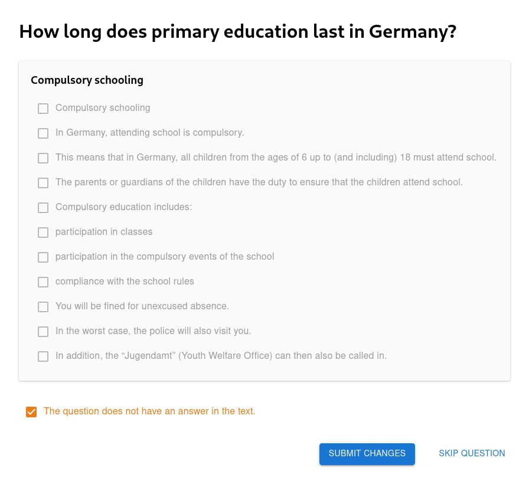

# Extractive QA Dataset for Integreat

This repository contains our [**integreat-qa** dataset](#dataset).
The dataset contains German and English questions in a German migration context with contexts taken from the [Integreat-App](https://github.com/digitalfabrik/integreat-app), an open-source and multilingual integration platform.

Our dataset and its construction as well as the evaluation of various approaches and models on this dataset are described in our paper
[OMoS-QA: A Dataset for Cross-Lingual Extractive Question Answering in a German Migration Context](https://aclanthology.org/2024.konvens-main.25/).

This repository also contains a web-based [annotation tool](#annotation-tool) to facilitate the manual extraction of answer sentences.
Furthermore, we evaluate different approaches and models on our dataset.

## Contents

- [Dataset](#dataset): Our dataset for QA in Integreat
- [Annotation Tool](#annotation-tool): A web-based annotation tool for answer sentence extraction
- [Evaluation](#evaluation): Evaluation of LLMs and encoder-only models on the integreat-qa dataset 

## Dataset

Our dataset consists of 906 diverse QA pairs in German and English.
The dataset is extractive, i.e., answers are given as sentence indices (breaking at the newline character `\n`).
Questions are automatically generated using an LLM.
The answers are manually annotated using voluntary crowdsourcing.

Our dataset is licensed under [cc-by-4.0](https://choosealicense.com/licenses/cc-by-4.0).
The dataset is also available on [hugging face](https://huggingface.co/datasets/digitalfabrik/integreat-qa).

### Properties

A QA pair consists of
- `question` (string): Question
- `context` (string): Full text from the Integreat-App
- `answers` (number[]): Indices of answer sentences

Furthermore, the following properties are present:
- `id` (number): A unique id for the QA pair
- `language` (string): The language of question and context.
- `sourceLanguage` (string | null): If question and context are machine translated, the source language.
- `city` (string): The city the page in the Integreat-App belongs to.
- `pageId` (number): The page id of the page in the Integreat-App.
- `jaccard` (number): The sentence-level inter-annotator agreement of manual answer annotation.

### Dataset Construction

An overview of the dataset construction can be seen here:

#### Question Generation

We generated questions automatically using two different approaches:
Prompting the model with the whole context and prompting with just a short three-word topic summary.

#### Answer Annotation

Our answer annotations are done manually by voluntary crowdsourcing using our web-based [annotation tool](#annotation-tool).
In order to guarantee high-quality annotations, we require two annotations per question.
Only questions with high inter-annotator agreement are present in our dataset.

## Annotation Tool

In order to facilitate the manual answer annotation, we created our own web-based annotation tool which can be found in [annotation-tool](annotation-tool).
The annotation tools consists of two components:
- A React [frontend](annotation-tool/frontend) written in TypeScript
- A Ktor [backend](annotation-tool/backend) written in Kotlin

## Evaluation

We describe our dataset construction process and the findings of our evaluation with different models and approaches in our paper:
[OMoS-QA: A Dataset for Cross-Lingual Extractive Question Answering in a German Migration Context](https://aclanthology.org/2024.konvens-main.25/)

The raw results and helper tools can be found in [evaluation](evaluation).
